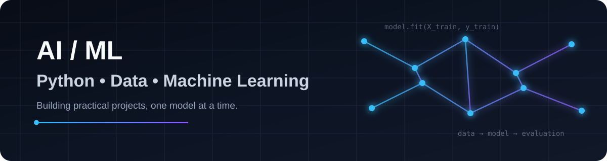
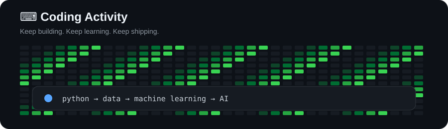

 

## About Me

I'm **Sachin Kumar**, a Python-focused developer building practical skills in **data analysis, machine learning, and AI**.

I enjoy turning datasets and ideas into working projects — from exploratory data analysis and visualization to machine-learning models and AI-powered applications.

**Current focus:** Python → Data → Machine Learning → AI

---

## Technical Stack

**Programming**

**Data & Visualization**

**Machine Learning & AI**

**Tools**

---

## Featured Projects

| Project | What it demonstrates |
|---|---|
| [**TutorChain**](https://github.com/SachinSingh-01/tutorchain-capstone) | Multi-agent AI tutor prototype, LLM integration, personalized learning, assessment and memory |
| [**Global Superstore EDA**](https://github.com/SachinSingh-01/global-superstore-eda) | EDA, Pandas, visualization and business-data analysis |
| [**Netflix Business Insights**](https://github.com/SachinSingh-01/netflix-business-insights) | Data cleaning, EDA, Pandas and visualization |
| [**Heart Disease Prediction**](https://github.com/SachinSingh-01/Heart-stroke-prediction) | KNN classification, Scikit-learn, preprocessing and Streamlit |
| [**Emotion Cipher**](https://github.com/SachinSingh-01/emotion-cipher-project) | Python, keyword-based emotion detection and Fernet encryption |

---

## Currently Learning

- Machine Learning with Scikit-learn
- Model evaluation
- Cross-validation
- Hyperparameter tuning
- Data analysis and visualization
- AI and LLM-based applications
- Problem solving with Python

---

## Coding Activity

---

### Learning by building.

**Python → Data → ML → AI**

